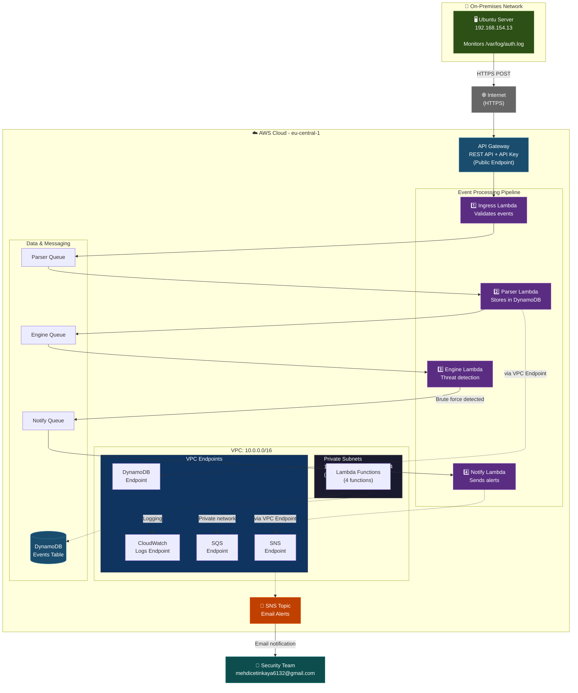

# SOAR Platform Architecture

```mermaid
flowchart TB
    subgraph OnPrem["🏢 On-Premises Network<br/>192.168.154.0/24"]
        Ubuntu["🖥️ Ubuntu Server<br/>192.168.154.13<br/><br/>Monitors /var/log/auth.log"]
    end
    
    Internet["🌐 Internet<br/>(HTTPS)"]
    
    subgraph AWS["☁️ AWS Cloud - eu-central-1"]
        API["API Gateway<br/>REST API + API Key<br/>(Public Endpoint)"]
        
        subgraph VPC["VPC: 10.0.0.0/16"]
            subgraph Private["Private Subnets<br/>10.0.100.0/24, 10.0.101.0/24<br/>(No Internet Access)"]
                Lambda["Lambda Functions<br/>(4 functions)"]
            end
            
            subgraph Endpoints["VPC Endpoints"]
                VPCE_DDB["DynamoDB<br/>Endpoint"]
                VPCE_SQS["SQS<br/>Endpoint"]
                VPCE_SNS["SNS<br/>Endpoint"]
                VPCE_Logs["CloudWatch<br/>Logs Endpoint"]
            end
        end
        
        subgraph Pipeline["Event Processing Pipeline"]
            Ingress["1️⃣ Ingress Lambda<br/>Validates events"]
            Parser["2️⃣ Parser Lambda<br/>Stores in DynamoDB"]
            Engine["3️⃣ Engine Lambda<br/>Threat detection"]
            Notify["4️⃣ Notify Lambda<br/>Sends alerts"]
        end
        
        subgraph Data["Data & Messaging"]
            DDB[("DynamoDB<br/>Events Table")]
            Q1["Parser Queue"]
            Q2["Engine Queue"]
            Q3["Notify Queue"]
        end
        
        SNS["📧 SNS Topic<br/>Email Alerts"]
    end
    
    User["👤 Security Team<br/>mehdicetinkaya6132@gmail.com"]
    
    Ubuntu -->|"HTTPS POST"| Internet
    Internet --> API
    API --> Ingress
    Ingress --> Q1
    Q1 --> Parser
    Parser -.->|"via VPC Endpoint"| VPCE_DDB
    VPCE_DDB -.-> DDB
    Parser --> Q2
    Q2 --> Engine
    Engine -->|"Brute force detected"| Q3
    Q3 --> Notify
    Notify -.->|"via VPC Endpoint"| VPCE_SNS
    VPCE_SNS -.-> SNS
    SNS -->|"Email notification"| User
    
    Lambda -.->|"Private network"| VPCE_SQS
    Lambda -.->|"Logging"| VPCE_Logs
    
    style Ubuntu fill:#2d5016,stroke:#4a7c1f,color:#fff
    style API fill:#1a4d6d,stroke:#2d7ba6,color:#fff
    style DDB fill:#1a4d6d,stroke:#2d7ba6,color:#fff
    style SNS fill:#c04000,stroke:#e65100,color:#fff
    style Ingress fill:#5a2d82,stroke:#7c3daa,color:#fff
    style Parser fill:#5a2d82,stroke:#7c3daa,color:#fff
    style Engine fill:#5a2d82,stroke:#7c3daa,color:#fff
    style Notify fill:#5a2d82,stroke:#7c3daa,color:#fff
    style Internet fill:#666,stroke:#999,color:#fff
    style User fill:#0d4d4d,stroke:#1a7a7a,color:#fff
    style Private fill:#1a1a2e,stroke:#444,color:#fff
    style Endpoints fill:#0f3460,stroke:#16213e,color:#fff
```

## Legenda

### Netwerk
- **On-Premises**: Ubuntu server (192.168.154.13) in lokaal netwerk
- **Internet**: Ubuntu stuurt events via HTTPS naar publieke API Gateway endpoint
- **API Gateway**: Publiek bereikbaar REST API endpoint met API key authenticatie
- **Private Subnets**: Lambda functies zonder directe internet toegang
- **VPC Endpoints**: Secure private connecties naar AWS services (geen internet nodig)

### Security Voordelen
1. **Geen VPN vereist** - API Gateway is publiek bereikbaar via HTTPS
2. **Geen NAT Gateway** - Lambda functies gebruiken VPC endpoints voor AWS services
3. **Cost-effective** - Lagere kosten zonder NAT Gateway ($0.045/uur = $32/maand bespaard)
4. **Secure** - Al het verkeer blijft binnen AWS backbone netwerk
5. **Isolated Lambda** - Functies draaien in private subnets zonder internet access

### Event Flow
1. Ubuntu detecteert mislukte SSH login → stuurt naar API Gateway
2. Ingress Lambda valideert → forward naar Parser Queue
3. Parser Lambda slaat op in DynamoDB → forward naar Engine Queue
4. Engine Lambda analyseert patroon → bij bedreiging naar Notify Queue
5. Notify Lambda verstuurt email via SNS naar security team

### Alarmniveaus
- 3 pogingen: Eerste waarschuwing
- 5 pogingen: Verhoogd alarm
- 10 pogingen: Mogelijk brute force
- 15+ pogingen: Bevestigde aanval
