# Cloud Compliance Scanning Platform - Architecture

## High-Level Architecture

```mermaid
flowchart TB
    subgraph User["👥 Users"]
        Free["Free Scan User"]
        Premium["Premium Scan User"]
        Subscriber["Subscription User"]
    end
    
    subgraph Frontend["🎨 Frontend Layer"]
        WebApp["Web Application<br/>React/Vue.js"]
        Dashboard["Compliance Dashboard<br/>(Abonnees)"]
    end
    
    subgraph API["🔌 API Layer"]
        Gateway["API Gateway<br/>REST API + Auth"]
        Auth["Azure OAuth<br/>Tenant Authorization"]
    end
    
    subgraph Processing["⚙️ Processing Pipeline - AWS Lambda"]
        Ingress["1️⃣ Ingress Lambda<br/>Request validation"]
        Scanner["2️⃣ Scanner Lambda<br/>Azure tenant data collection"]
        Analyzer["3️⃣ Analyzer Lambda<br/>AI compliance analysis"]
        Reporter["4️⃣ Reporter Lambda<br/>Report generation"]
        Scheduler["5️⃣ Scheduler Lambda<br/>Monthly automated scans"]
    end
    
    subgraph Data["💾 Data Layer"]
        DDB[("DynamoDB<br/>Scan results & metadata")]
        S3[("S3 Bucket<br/>Documents (encrypted)<br/>Generated reports")]
    end
    
    subgraph External["🔗 External Services"]
        Azure["Microsoft Azure<br/>Resource Manager API<br/>Security Center"]
        Payment["Payment Providers<br/>Stripe & Mollie"]
        Email["Email Service<br/>SNS/SendGrid"]
    end
    
    subgraph Queue["📬 Message Queues"]
        Q1["Scanner Queue"]
        Q2["Analyzer Queue"]
        Q3["Reporter Queue"]
    end
    
    Free & Premium & Subscriber --> WebApp
    Subscriber --> Dashboard
    WebApp --> Gateway
    Dashboard --> Gateway
    Gateway --> Auth
    Auth --> Azure
    Gateway --> Ingress
    Ingress --> Q1
    Q1 --> Scanner
    Scanner --> Azure
    Scanner --> DDB
    Scanner --> Q2
    Q2 --> Analyzer
    Analyzer --> S3
    Analyzer --> DDB
    Analyzer --> Q3
    Q3 --> Reporter
    Reporter --> S3
    Reporter --> Email
    Premium --> Payment
    Scheduler -.->|"Monthly trigger"| Ingress
    
    style Free fill:#90EE90,stroke:#228B22,color:#000
    style Premium fill:#FFD700,stroke:#DAA520,color:#000
    style Subscriber fill:#87CEEB,stroke:#4682B4,color:#000
    style Gateway fill:#1a4d6d,stroke:#2d7ba6,color:#fff
    style DDB fill:#1a4d6d,stroke:#2d7ba6,color:#fff
    style S3 fill:#1a4d6d,stroke:#2d7ba6,color:#fff
    style Azure fill:#0078D4,stroke:#005A9E,color:#fff
    style Payment fill:#635BFF,stroke:#4A47B0,color:#fff
```



## Service Architectures

### 1. Gratis Scan Architecture

**Flow:**
```
User → Web App → API Gateway → Ingress → Scanner → Analyzer (limited) → Reporter (preview)
                                    ↓           ↓            ↓
                                DynamoDB    Azure API    S3 (temp)
```

**Kenmerken:**
- Geen payment processing
- Beperkte analyse (first 2 findings only)
- 7-dagen data retention
- Geen document storage
- Snelle processing (< 5 min)

**Resource Limits:**
- Scanner: 256MB RAM, 5 min timeout
- Analyzer: 512MB RAM, max 2 findings
- Reporter: 256MB RAM, preview template

### 2. Premium Scan Architecture

**Flow:**
```
User → Upload Docs → Payment → Azure Auth → Full Scan
           ↓            ↓          ↓            ↓
        S3 (enc)    Stripe/     Azure      DynamoDB
                    Mollie       API
           ↓
    AI Document Parser
           ↓
    Compliance Mapping ←→ Tenant Data
           ↓
    Gap Analysis
           ↓
    Full Report → Email Notification
```

**Components:**
1. **Document Handler Lambda**
   - Upload to S3 encrypted
   - OCR if needed
   - Parse policy documents
   - Extract compliance requirements

2. **Payment Handler Lambda**
   - Webhook processing (Stripe/Mollie)
   - Payment verification
   - Trigger scan on success

3. **Full Scanner Lambda**
   - Complete tenant analysis
   - All Azure resources
   - Security Center integration
   - Policy API calls

4. **AI Analyzer Lambda**
   - NLP on documents
   - Compliance mapping
   - Gap identification
   - Risk scoring
   - Remediation suggestions

5. **Report Generator Lambda**
   - Comprehensive report
   - Charts and visualizations
   - PDF/Excel export
   - S3 storage (1 year)

**Resource Configuration:**
- Scanner: 1024MB RAM, 15 min timeout
- Analyzer: 2048MB RAM, 10 min timeout
- AI Model: Bedrock/SageMaker integration

### 3. Abonnement Architecture

**Flow:**
```
Monthly Scheduler (EventBridge)
       ↓
Check Active Subscriptions (DynamoDB)
       ↓
Trigger Automated Scan (per tenant)
       ↓
Full Analysis Pipeline
       ↓
Generate Report with Historical Comparison
       ↓
Update Dashboard Data
       ↓
Send Email + Invoice
```

**Additional Components:**

1. **Subscription Manager Lambda**
   - Manages subscription lifecycle
   - Tracks scan schedule
   - Invoice generation
   - Payment reminders

2. **Scheduler Lambda** (EventBridge triggered)
   - Runs daily
   - Checks due scans
   - Triggers automated scans
   - Handles failures/retries

3. **Trend Analyzer Lambda**
   - Compares with previous scans
   - Calculates trends
   - Generates insights
   - Dashboard data preparation

4. **Invoice Generator Lambda**
   - Monthly invoice creation
   - 14-day payment terms
   - Email distribution
   - Payment tracking

**Data Model for Subscriptions:**
```
Subscription {
  subscription_id
  user_id
  tenant_id
  status: active/suspended/cancelled
  start_date
  billing_cycle: monthly
  last_scan_date
  next_scan_date
  scans_completed: []
}

HistoricalScan {
  scan_id
  subscription_id
  scan_date
  compliance_score
  findings_count
  trend: improved/degraded/stable
}
```

## Data Flow Details

### Gratis Scan Data Flow


### Premium Scan Data Flow


### Abonnement Data Flow


## Azure Integration

### Required Azure Permissions
```yaml
Permissions:
  - Reader (subscription level)
  - Security Reader
  - Policy Reader
  
APIs Used:
  - Azure Resource Manager API
  - Azure Policy API
  - Azure Security Center API
  - Azure AD Graph API (tenant info)
```

### OAuth Flow
1. User initiates scan
2. Redirect to Azure OAuth consent
3. User grants permissions
4. Azure returns access token
5. Platform uses token for API calls
6. Token refresh mechanism (30-day validity)

## Security Architecture

### Data Security
- **Encryption at rest**: All S3 data encrypted (AES-256)
- **Encryption in transit**: TLS 1.3 for all communications
- **Document storage**: Separate encrypted buckets per user
- **Access control**: IAM roles with least privilege

### Authentication & Authorization
- **User auth**: JWT tokens
- **Azure auth**: OAuth 2.0
- **API auth**: API keys + rate limiting
- **Subscription verification**: Before each automated scan

### Compliance
- GDPR compliant data handling
- Right to deletion
- Data retention policies
- Audit logging
- ISO 27001 aligned operations

## Scalability Considerations

### Lambda Scaling
- Concurrent execution limits per service tier
- Auto-scaling based on queue depth
- Reserved concurrency for premium scans

### Database Optimization
- DynamoDB on-demand pricing
- Efficient indexing strategy
- Partition key: user_id
- Sort key: scan_date

### Cost Optimization
- S3 lifecycle policies (7d → 1y retention)
- Lambda memory optimization
- Intelligent tiering for S3
- CloudWatch metrics for monitoring

## Monitoring & Alerting

### Metrics
- Scan completion rate
- Processing duration per tier
- Error rates
- Payment success rate
- Queue depth
- Cost per scan

### Alerts
- Failed scans (immediate)
- Payment failures (immediate)
- Queue backlog > threshold (5 min)
- High error rates (15 min)
- Cost anomalies (daily)

## Disaster Recovery

### Backup Strategy
- DynamoDB: Point-in-time recovery (35 days)
- S3: Versioning enabled
- Lambda: Version all functions
- Infrastructure: Terraform state backup

### Recovery Procedures
- RTO: 1 hour
- RPO: 15 minutes
- Multi-AZ deployment
- Automated failover

## Development & Deployment

### CI/CD Pipeline
```
Git Push → GitHub Actions → Run Tests → Terraform Plan → 
Manual Approval (prod) → Terraform Apply → Lambda Deploy → 
Integration Tests → Production
```

### Environments
- **Development**: Full feature parity, test data
- **Staging**: Production-like, pre-release testing
- **Production**: Live customer data

## Future Enhancements

1. **Multi-cloud support**: AWS, GCP expansion
2. **More frameworks**: SOC 2, ISO 27001, NIST
3. **Automated remediation**: One-click fixes
4. **API for CI/CD**: Integrate in DevOps pipelines
5. **White-label**: Partner branding options
6. **Mobile app**: iOS/Android native apps

## Key Technical Decisions

| Decision | Rationale |
|----------|-----------|
| AWS Lambda | Serverless, pay-per-use, auto-scaling |
| DynamoDB | NoSQL flexibility, serverless scaling |
| S3 | Cost-effective storage, encryption built-in |
| Terraform | Infrastructure as Code, version control |
| Python | Lambda runtime, rich libraries for AI/NLP |
| React/Vue | Modern frontend, component-based |

## Performance Targets

| Metric | Target |
|--------|--------|
| Free scan duration | < 5 minutes |
| Premium scan duration | < 30 minutes |
| Dashboard load time | < 2 seconds |
| API response time | < 500ms (p95) |
| Report generation | < 5 minutes |
| Uptime | 99.9% |
