# SOAR Platform Architecture

```mermaid
flowchart TB
    subgraph OnPrem["🏢 On-Premises Network<br/>192.168.154.0/24"]
        Ubuntu["🖥️ Ubuntu Server<br/>192.168.154.13<br/><br/>Monitors /var/log/auth.log"]
    end
    
    subgraph VPN["🔒 VPN Connection"]
        Tunnel1["Tunnel 1: 3.124.83.221"]
        Tunnel2["Tunnel 2: 63.177.155.118"]
    end
    
    subgraph AWS["☁️ AWS Cloud - eu-central-1"]
        subgraph VPC["VPC: 10.0.0.0/16"]
            subgraph Public["Public Subnets"]
                NAT1["NAT Gateway<br/>10.0.1.0/24"]
                NAT2["NAT Gateway<br/>10.0.2.0/24"]
            end
            
            subgraph Private["Private Subnets<br/>10.0.101.0/24, 10.0.102.0/24"]
                Lambda["Lambda Functions"]
            end
        end
        
        API["API Gateway<br/>REST API + API Key"]
        
        subgraph Pipeline["Event Processing Pipeline"]
            Ingress["1️⃣ Ingress Lambda<br/>Validates events"]
            Parser["2️⃣ Parser Lambda<br/>Stores in DynamoDB"]
            Engine["3️⃣ Engine Lambda<br/>Threat detection"]
            Notify["4️⃣ Notify Lambda<br/>Sends alerts"]
        end
        
        subgraph Data["Data & Messaging"]
            DDB[("DynamoDB<br/>Events Table")]
            Q1["Parser Queue"]
            Q2["Engine Queue"]
            Q3["Notify Queue"]
        end
        
        SNS["📧 SNS Topic<br/>Email Alerts"]
    end
    
    User["👤 Security Team<br/>mehdicetinkaya6132@gmail.com"]
    
    Ubuntu -->|"Failed SSH login events"| VPN
    VPN --> API
    API --> Ingress
    Ingress --> Q1
    Q1 --> Parser
    Parser --> DDB
    Parser --> Q2
    Q2 --> Engine
    Engine -->|"Brute force detected"| Q3
    Q3 --> Notify
    Notify --> SNS
    SNS -->|"Email notification"| User
    
    Lambda -.->|"Internet access"| NAT1
    Lambda -.->|"Internet access"| NAT2
    
    style Ubuntu fill:#2d5016,stroke:#4a7c1f,color:#fff
    style API fill:#1a4d6d,stroke:#2d7ba6,color:#fff
    style DDB fill:#1a4d6d,stroke:#2d7ba6,color:#fff
    style SNS fill:#c04000,stroke:#e65100,color:#fff
    style Ingress fill:#5a2d82,stroke:#7c3daa,color:#fff
    style Parser fill:#5a2d82,stroke:#7c3daa,color:#fff
    style Engine fill:#5a2d82,stroke:#7c3daa,color:#fff
    style Notify fill:#5a2d82,stroke:#7c3daa,color:#fff
    style VPN fill:#666,stroke:#999,color:#fff
    style User fill:#0d4d4d,stroke:#1a7a7a,color:#fff
```

## Legenda

### Netwerk
- **On-Premises**: Ubuntu server (192.168.154.13) in lokaal netwerk
- **VPN**: Site-to-Site VPN verbinding naar AWS
- **Public Subnets**: NAT Gateways voor uitgaand internet verkeer
- **Private Subnets**: Lambda functies zonder directe internet toegang

### Event Flow
1. Ubuntu detecteert mislukte SSH login → stuurt naar API Gateway
2. Ingress Lambda valideert → forward naar Parser Queue
3. Parser Lambda slaat op in DynamoDB → forward naar Engine Queue
4. Engine Lambda analyseert patroon → bij bedreiging naar Notify Queue
5. Notify Lambda verstuurt email via SNS naar security team

### Alarmniveaus
- 3 pogingen: Eerste waarschuwing
- 5 pogingen: Verhoogd alarm
- 10 pogingen: Mogelijk brute force
- 15+ pogingen: Bevestigde aanval
