# SOAR Security Platform

Automated security system that detects SSH brute force attacks and sends instant email alerts.

[](https://aws.amazon.com/)
[](https://aws.amazon.com/lambda/)

---

## Table of Contents

- [Overview](#overview)
- [Architecture](#architecture)
- [Alerts](#alerts)
- [Technology](#technology)
- [Security](#security)
- [Deployment](#deployment)
- [Project Structure](#project-structure)
- [Cost Optimization](#cost-optimization)

---

## Overview

A **SOAR** (Security Orchestration, Automation, and Response) platform that monitors Ubuntu servers 24/7 for suspicious login attempts.   When brute force patterns are detected, security teams are automatically alerted via email. 

### The Problem

Hackers execute thousands of automated brute force attacks on servers daily.   Manual monitoring is impossible and late detection leads to successful data breaches. 

### The Solution

This system: 
- Continuously monitors `/var/log/auth.log` on Ubuntu server
- Detects failed SSH login attempts in real-time
- Analyzes patterns (number of attempts per IP within 2 minutes)
- Sends automatic email alerts for suspicious behavior

---

## Architecture

```mermaid
flowchart TB
    subgraph OnPrem["🏢 On-Premises Network<br/>192.168.154.0/24"]
        Ubuntu["🖥️ Ubuntu Server<br/>192.168.154.13<br/><br/>Monitors /var/log/auth.log"]
    end
    
    Internet["🌐 Internet<br/>(HTTPS)"]
    
    subgraph AWS["☁️ AWS Cloud - eu-central-1"]
        API["API Gateway<br/>REST API + API Key<br/>(Public Endpoint)"]
        
        subgraph VPC["VPC:   10.0.0.0/16"]
            subgraph Private["Private Subnets<br/>10.0.100.0/24, 10.0.101.0/24<br/>(No Internet Access)"]
                Lambda["Lambda Functions<br/>(4 functions)"]
            end
            
            subgraph Endpoints["VPC Endpoints"]
                VPCE_DDB["DynamoDB<br/>Endpoint"]
                VPCE_SQS["SQS<br/>Endpoint"]
                VPCE_SNS["SNS<br/>Endpoint"]
                VPCE_Logs["CloudWatch<br/>Logs Endpoint"]
            end
        end
        
        subgraph Pipeline["Event Processing Pipeline"]
            Ingress["1️⃣ Ingress Lambda<br/>Validates events"]
            Parser["2️⃣ Parser Lambda<br/>Stores in DynamoDB"]
            Engine["3️⃣ Engine Lambda<br/>Threat detection"]
            Notify["4️⃣ Notify Lambda<br/>Sends alerts"]
        end
        
        subgraph Data["Data & Messaging"]
            DDB[("DynamoDB<br/>Events Table")]
            Q1["Parser Queue"]
            Q2["Engine Queue"]
            Q3["Notify Queue"]
        end
        
        SNS["📧 SNS Topic<br/>Email Alerts"]
    end
    
    User["👤 Security Team<br/>security@company.com"]
    
    Ubuntu -->|"HTTPS POST"| Internet
    Internet --> API
    API --> Ingress
    Ingress --> Q1
    Q1 --> Parser
    Parser -.->|"via VPC Endpoint"| VPCE_DDB
    VPCE_DDB -.-> DDB
    Parser --> Q2
    Q2 --> Engine
    Engine -->|"Brute force detected"| Q3
    Q3 --> Notify
    Notify -.->|"via VPC Endpoint"| VPCE_SNS
    VPCE_SNS -.-> SNS
    SNS -->|"Email notification"| User
    
    Lambda -.->|"Private network"| VPCE_SQS
    Lambda -.->|"Logging"| VPCE_Logs
    
    style Ubuntu fill:#2d5016,stroke:#4a7c1f,color:#fff
    style API fill:#1a4d6d,stroke:#2d7ba6,color:#fff
    style DDB fill:#1a4d6d,stroke:#2d7ba6,color:#fff
    style SNS fill:#c04000,stroke:#e65100,color:#fff
    style Ingress fill:#5a2d82,stroke:#7c3daa,color:#fff
    style Parser fill:#5a2d82,stroke:#7c3daa,color:#fff
    style Engine fill:#5a2d82,stroke:#7c3daa,color:#fff
    style Notify fill:#5a2d82,stroke:#7c3daa,color:#fff
    style Internet fill:#666,stroke:#999,color:#fff
    style User fill:#0d4d4d,stroke:#1a7a7a,color:#fff
    style Private fill:#1a1a2e,stroke:#444,color:#fff
    style Endpoints fill:#0f3460,stroke:#16213e,color:#fff
```



### How It Works

```
Ubuntu Server → HTTPS → API Gateway → Lambda (VPC) → Email Alert
```

1. **Ingress**:  Validates incoming events
2. **Parser**:  Stores events in DynamoDB
3. **Engine**:  Detects brute force patterns
4. **Notify**:  Sends email via SNS

**Network Architecture**:
- Ubuntu server sends events via **HTTPS** to public API Gateway endpoint
- Lambda functions run in **private VPC subnets** for maximum security
- **VPC Endpoints** provide direct AWS service communication (DynamoDB, SQS, SNS)
- **No NAT Gateway** needed - everything via VPC endpoints (lower costs)
- **No VPN** needed - API Gateway is publicly accessible via HTTPS

### Security Benefits
1. **No VPN Required** - API Gateway is publicly accessible via HTTPS
2. **No NAT Gateway** - Lambda functions use VPC endpoints for AWS services
3. **Cost-Effective** - Lower costs without NAT Gateway ($0.045/hour = $32/month saved)
4. **Secure** - All traffic stays within AWS backbone network
5. **Isolated Lambda** - Functions run in private subnets without internet access

### Real-World Testing


---

## Alerts

| Attempts | Action |
|----------|--------|
| 3x | Initial warning |
| 5x | Elevated alert |
| 10x | Possible brute force |
| 15x+ | Confirmed attack |

### Email Alert Example


---

## Technology

**AWS Serverless**:
- Lambda (event processing in VPC)
- DynamoDB (event storage)
- SQS (message queues)
- SNS (email notifications)
- API Gateway (REST API)
- VPC Endpoints (secure AWS service access)

**Infrastructure**:
- Terraform (IaC)
- GitHub Actions (CI/CD)

### CloudWatch Monitoring


---

## Security

I considered multiple security aspects this case study as you may have already read. I don't use NAT, so no egress internet usage. Ingress can only come from the API Gateway and not from other resources. Within the network, services reach each other via VPC endpoints. Lambda is private and not public. SOAR ensures that I demonstrate I work securely. Lambda notify sends a security notification when there are more than 3 failed login attempts on the on-premises web server. This is checked by Lambda function engine (only after 3 times). It also determines the security level and whether it's something serious. These actions are all monitored and can be found in my custom dashboard.

**Security Measures Implemented:**

- **Private Network Architecture** ([vpc.tf](terraform/vpc.tf), [vpc_endpoints.tf](terraform/vpc_endpoints.tf)): Lambda functions deployed in private subnets, all AWS service communication via VPC endpoints
- **Access Control** ([api_gateway.tf](terraform/api_gateway.tf), [security_groups.tf](terraform/security_groups.tf)): API Gateway as single ingress point, least-privilege IAM roles per Lambda function
- **SOAR Security** ([engine.py](lambda/engine/engine.py), [notify.py](lambda/notify/notify.py)): Automated threat detection from failed SSH attempts, security notifications via SNS
- **Monitoring** ([dashboard.tf](terraform/dashboard.tf)): CloudWatch dashboard for security event visibility
- **Secure Deployment** (.github/workflows/terraform-deploy.yml): OIDC authentication instead of static credentials, encrypted S3 state backend

---

## Deployment

Fully automated via GitHub Actions on every push to main branch. 

```bash
# Manual deployment
cd terraform
terraform init && terraform apply
```

---

## Project Structure

```
casestudy2/
├── lambda/           # 4 Lambda functions
│   ├── ingress/
│   ├── parser/
│   ├── engine/
│   └── notify/
├── terraform/        # Infrastructure as Code
├── scripts/          # Helper scripts
└── . github/          # CI/CD workflows
```

---

## Cost Optimization

- 💰 **VPC Endpoints** - No NAT Gateway needed (~$32/month savings)
- 💰 **Serverless Lambda** - Pay only for execution time
- 💰 **DynamoDB On-Demand** - Pay-per-request pricing

**Estimated Monthly Cost**:  ~$10-20/month

---

## Academic Context

**Case Study 2** | Fontys University of Applied Sciences | Semester 3 | 2025  
Demonstrates cloud-native security automation and DevOps principles.

---

**Student**:   Mehdi Cetinkaya
