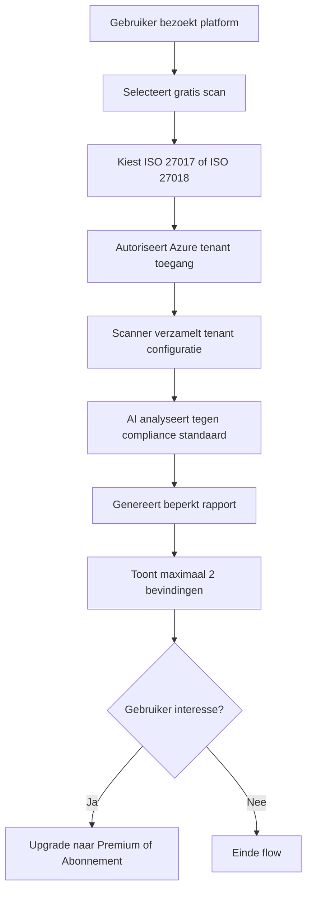
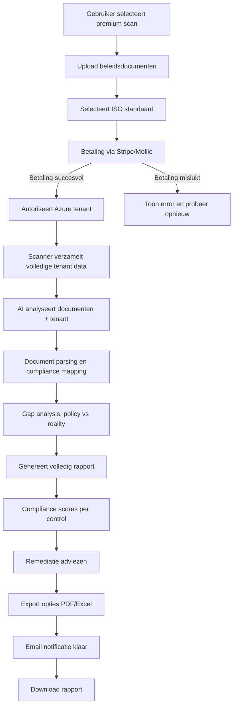
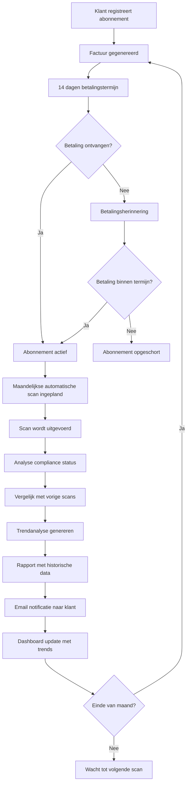

# Data Flow Diagrams - Cloud Compliance Scanning Platform

## Overview

Dit document beschrijft de data flows voor de drie verschillende services die het platform aanbiedt.

## 1. Gratis Scan Flow



**Kenmerken:**
- Geen authenticatie vereist (alleen Azure OAuth)
- Minimale data collectie
- Beperkte resultaten (max 2 findings)
- Preview modus rapport
- Directe feedback

**Data opslag:**
- Scan resultaten: 7 dagen
- Gebruiker email (optioneel voor follow-up)
- Geen beleidsdocumenten

## 2. Premium Scan Flow (Eenmalige Betaalde Scan)



**Kenmerken:**
- Pre-payment vereist
- Document upload (max 50MB per document)
- Volledige Azure tenant analyse
- AI-powered document analyse
- Comprehensive compliance rapport

**Data opslag:**
- Scan resultaten: 1 jaar
- Geüploade documenten: Encrypted, 1 jaar
- Betaling records: Permanent (compliance)
- Rapport exports: 1 jaar

**Data processing:**
1. Document parsing (OCR indien nodig)
2. NLP analyse van beleidsregels
3. Tenant configuratie extraction
4. Cross-reference policy ↔ implementation
5. Gap identification
6. Risk scoring
7. Prioritization van bevindingen
8. Remediatie suggesties

## 3. Abonnement Flow



**Kenmerken:**
- Maandelijks €99 per tenant
- **1 geautomatiseerde scan per maand** (GEEN gratis extra scans)
- Automatische rapportage
- Historische compliance tracking
- Trendanalyse over tijd
- Factuur met 14 dagen betalingstermijn

**Data opslag:**
- Alle scan resultaten: Permanent (tijdens abonnement)
- Historische trends: Permanent
- Compliance scores: Per scan opgeslagen
- Facturen: Permanent

**Automatisering:**
1. **Maandelijkse scheduler** triggert scan
2. **Automatische tenant scan** zonder user interventie
3. **Auto-generatie rapport** met trends
4. **Email distributie** naar stakeholders
5. **Dashboard update** real-time
6. **Facturatie systeem** triggert maandelijkse factuur

**Belangrijke verduidelijking:**
- Abonnement ≠ gratis scan per maand
- Abonnement = 1 geautomatiseerde scan per maand
- Extra scans moeten apart aangeschaft worden als premium scan
- Automatische scan is deel van subscription value

## Data Architecture

### Database Schema (conceptueel)

```
Users
- user_id (PK)
- email
- company_name
- subscription_tier (free/premium/subscription)
- created_at

Scans
- scan_id (PK)
- user_id (FK)
- scan_type (free/premium/automated)
- iso_standard (27017/27018)
- tenant_id
- scan_date
- status (pending/completed/failed)

ScanResults
- result_id (PK)
- scan_id (FK)
- finding_type
- severity (critical/high/medium/low)
- control_reference
- current_state
- required_state
- remediation_advice
- visible_in_free_scan (boolean)

Documents
- document_id (PK)
- scan_id (FK)
- filename
- upload_date
- storage_location (encrypted)
- processed (boolean)

Subscriptions
- subscription_id (PK)
- user_id (FK)
- start_date
- status (active/suspended/cancelled)
- billing_cycle
- last_scan_date
- next_scan_date

Invoices
- invoice_id (PK)
- subscription_id (FK)
- amount
- issue_date
- due_date (issue_date + 14 days)
- status (pending/paid/overdue)
```

## Security & Privacy

### Data Protection
- Alle tenant data: Encrypted at rest en in transit
- Beleidsdocumenten: Separate encrypted storage
- GDPR compliant data retention
- Right to deletion after subscription end

### Access Control
- Azure OAuth voor tenant access
- Time-limited access tokens
- Least privilege principle
- Audit logging van alle data access

## Integration Points

### Azure Integration
- Azure AD OAuth voor authentication
- Azure Resource Manager API voor tenant scanning
- Azure Policy API voor compliance checks
- Azure Security Center integration

### Payment Processing
- Stripe voor credit card payments (premium scans)
- Mollie voor iDEAL/SEPA (Nederlandse markt)
- Webhook handling voor payment confirmation
- Automated invoice generation voor subscriptions

### Notification System
- Email notifications via SendGrid/AWS SES
- Dashboard real-time updates via WebSocket
- SMS notifications (optioneel) voor critical findings
- Webhook support voor externe integraties

## Performance Considerations

### Scan Duration
- Gratis scan: 2-5 minuten
- Premium scan: 15-30 minuten (afhankelijk van tenant grootte)
- Abonnement scan: Automated, off-peak hours

### Scalability
- Parallel scan processing
- Queue-based architecture
- Auto-scaling compute resources
- Caching van compliance rules

## Compliance & Audit

### Audit Trail
- Alle scans gelogd met timestamp
- User actions getraceerd
- Document access gelogd
- Payment transactions geregistreerd

### Retention Policy
- Gratis scans: 7 dagen
- Premium scans: 1 jaar
- Abonnement data: Permanent tijdens abonnement
- Na cancellation: 90 dagen grace period
